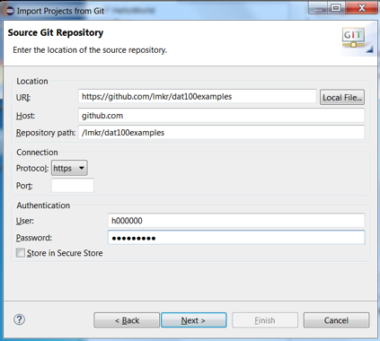
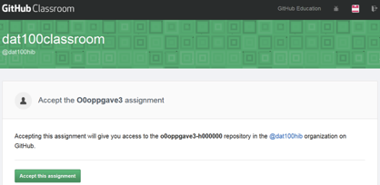
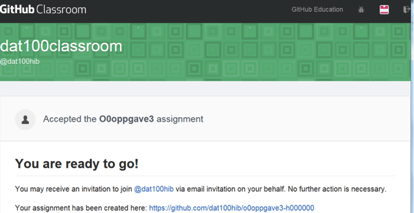

# DAT100: Java Programmering 0
## Eclipse IDE, JDK og Git

Formålet med denne programmeringslab er å sikre at du har en fungerende installasjon av JDK og Eclipse på egen PC.

Du må **gjøre tre ting** for å få denne første programmeringsoppgaven godkjent.

- [x] Demonstrere den kjørende applikasjonen i oppgave 1 og oppgave 4 til labassistent eller faglærer. Dette kan gjøres på programmeringslaben ifm. forelesning, eller ved å gjøre en individuell avtale.

- [x] Levere inn filen Velkommen.java via Canvas. Filen finnes i mappen `Velkommen/src/no/hvl/dat100` i arbeidsområdet (workspace) for Eclipse.

- [x]	Levere inn Eclipse-prosjektet i oppgave 3 på oppbevaringsplassen på github classroom.

**Deadline** for innlevering/godkjenning av øvingen er **31. august kl. 16.00**.
Ta kontakt med faglærer eller lab-assistent dersom du har problemer med oppgavene.

### Oppgave 1: Første JAVA Eclipse-prosjekt

I denne oppgaven skal du opprette et programmeringsprosjekt i Eclipse, skrive og kjøre et enkelt Java program.

1.	Start Eclipse
2.	Velg *File | New | Java Project* og skriv inn Velkommen som prosjektnavn. Trykk *Finish*
3.	Velg *File | New | Class* og skriv inn `no.hvl.dat100` som pakkenavn og `Velkommen` som klassenavn. Kryss av for å generere `public static void main` automatisk. Trykk *Finish*

    Skriv inn:

```java
System.out.println("Nå virker det!");
```

slik at hele filen ser slik ut:

```java
package no.hvl.dat100;

public class Velkommen {
    public static void main(String[] args){
    	System.out.println("Nå virker det!");
    }
}
```

4.	Velg *Run | Run* for å utføre programmet. Dersom du får spørsmål om det skal utføres som Java Application eller Java Applet, så velger du Java Application
5.	Du vil nå få utskriften i konsoll-vinduet (nederst i Eclipse vinduet).
6.	Modifiser programmet slik det skriver ut en linje med 10 stjerner ********** før og etter selve teksten.

### Oppgave 2: Sjekke ut kode fra github

Vi skal bruke <www.github.com> til å distribuere kodeeksempler fra forelesninger og startkode for programmeringsoppgaver. Til dette formålet er der opprettet en oppbevaringsplass (repository) med navnet H2017 på github som vil inneholde Eclipse-prosjekter for eksemplene.

#### 2a - opprette en github konto

For å få tilgang til oppbevaringsplassene som skal brukes i faget må du opprette en brukerkonto på <www.github.com> og angi et brukernavn, epost og passord:

1. Bruk studentnummeret dit som brukernavn (username) (**VIKTIGT**). Eksempelvis h428400 om du har studentnummer 428400.
2. I Step 2 (Choose your plan) velg Unlimited public repositories for free.

Du vil få en e-post fra github der du blir bedt om å verifisere at e-post addressen er gyldig.

#### 2b - opprette lokal kopi av oppbevaringsplassen

Du kan nå sjekke ut Eclipse-prosjekter med kodeeksempler på egen PC via Eclipse:

1.	Velg *File | Import… | Git | Projects from Git | Clone URI*
2.	I dialogboksen limer du inn følgende <https://github.com/dat100hib/H2017.git> i feltet URI. Dette angir lokasjon av oppbevaringsplassen for eksempelkode på github.

    

3.	Under *Authentication* legger du inn brukernavn og passord for github-kontoen din og trykker Next.
4.	I dialogboksen *Branch Selection* velg *master* og trykk *Next*.
5.	I dialogboksen *Local Destination* må du under *Directory* velge en mappe på PC’en der du ønsker å lagre den lokale kopien av oppbevaringsplassen.
6.	I dialogboksen *Select a wizard* to use for importing projects velg *Import existing Eclipse Projects* og trykk *Next*.
7.	I dialogboksen *Import Projects* velg *F01Introduksjon* og trykk *Finish*. Da vil Eclipse-prosjektene med eksempelkode fra første forelesning være tilgjengelig.

#### 2c - tilgang til nye og oppdaterte prosjekt

Etter hvert i faget oppdaterer vi eksempelprosjektene og du får også bruk for å få tilgang til eksempler for de neste forelesninger. For å få tilgang til de må du oppdatere den lokale oppbevaringsplassen på PC’en din:

1.	Velg et av eksempelprosjektene i Eclipse, høyre-klikk og velg *Team | Pull*.   Dette oppdaterer oppbevaringsplassen for eksempler på din PC.
2.	Velg *File | Import… | Git | Projects from Git | Existing local repository* og trykk *Next*.
3.	I dialogboksen *Select a Git Repository* velg *H2017* og trykk *Next*.
4.	I dialogboksen *Select a wizard to use for importing projects* velg *Import existing Eclipse Projects*, vælg mappen *forelesninger* og trykk *Next*
5.	I dialogboksen *Import Projects* kan du nå velge de Eclipse-prosjekter du ønsker å importere inn i Eclipse

### Oppgave 3: Github classroom og JUnit enhetstesting

For noen programmeringsoppgaver skal vi bruke JUnit til å teste java-koden som dere skriver. Videre skal vi for noen obligatoriske innleveringer bruke github classroom til å distribuere den java-koden dere skal ta utgangspunkt i og bruke github classroom til å levere inn koden. Github classroom er en overbygging på github.

Formålet med denne og neste oppgave er å bli kjent med JUnit og github classroom ved å gjennomføre en liten innlevering.

#### 3a - akseptere programmeringsoppgaven

Første steg er å akseptere programmeringsoppgaven for å få tilgang til den Java-kode du skal ta utgangspunkt i. Dette gjøre ved å åpne en nettleser og gå til følgende adresse (URL):

https://classroom.github.com/assignment-invitations/ea54fbe64f58eea431c9ff6845a4803a

Ved å gå til denne adressen kommer du inn i github classroom og kan akseptere oppgaven:

1.	Trykk på *Authorize application*

    

2.	Velg *Accept this assignment*

    

3.	Trykk på lenken rett etter *your assignment has been created here*. Slutten på den lenken du får vil ikke være helt identisk med det er vist på billedet siden det er en lenke til din egen oppbevaringsplass for den koden du skal ta utgangspunkt i.

    

#### 3b - laste ned og åpne startkode

Du må nå laste ned (sjekke ut) den koden som du skal ta utgangspunkt i:

1.	Velg *Clone or Download* på github-siden i nettleseren som kom frem etter punkt 3 ovenfor.


2.	Velg lenken og sjekk ut koden som beskrevet i punktene 1-7 i oppgave 2.

#### 3c - kjøre enhetstester

Eksempelkoden inneholder et Eclipse-prosjekt Kalkulator som implementerer en enkel kalkulator med enkelt brukergrensesnitt.

1.	Kjør applikasjonen ved å velge prosjektet Kalkulator etterfulgt av *Run | Run*
2.	Kjør JUnit enhetstestene i prosjektet ved å velge filen `TestKalkulator.java` etterfulgt av  *Run | Run As | JUnit Test*

Enhetstestene i punkt 2 ovenfor feiler fordi ikke alt er implementert i filen `Kalkulator.java`:

1.	Åpn filen `Kalkulator.java` i editoren ved å dobbel-klikke på den.
2.	Implementer metodene `add`, `sub`, `mul` og `div` som vist på første forelesning.

Kjør enhets-testene igjen og prøv applikasjonen via grensesnittet. Sjekk at alt fungerer som ønsket.

#### 3d - levere inn koden

Når kalkulatoren fungerer som den skal må du levere inn koden din via github classroom:

1.	Høyre-klikk på prosjektet *Kalkulator* i Eclipse og velg *Team | Add to Index*. Dette forbereder java-filene som du har endret i prosjektet for å bli lastet opp på den lokale oppbevaringsplassen på PC og på oppbevaringsplassen på github classroom.
2.	Høyre-klikk på prosjektet *Kalkulator* i Eclipse og velg *Team | Commit …*
3.	Under *Commit Message* skriv eksempelvis «leverer inn koden» og trykk *Commit and Push*

Du kan sjekke at koden er levert inn ved å gå på <https://www.github.com> og velge oppbevaringsplassen for oppgaven du leverte inn.

### Oppgave 4: Bruk av EasyGraphics

I forbindelse med forelesninger og programmeringsoppgaver skal vi bruke biblioteket easygraphics til å illustrere en del begreper innen programmering. Formålet med denne oppgaven er å vise hvordan man bruker easygraphics biblioteket i egne programmer.

For å kunne bruke easygraphics biblioteket i egen kode må Eclipse-prosjektet ha en referanse til en jar-fil som inneholder java-koden for biblioteket. Jar-filen `easygraphics.jar` finnes i mappen `easygraphics/lib` der du sjekket ut koden fra github i oppgave 2.

1.	Opprett et nytt Eclipse-prosjekt som i oppgave 1 med navnet *EasyGraphicsTest*. Se evt. oppgave 1 for informasjon om hvordan man oppretter et prosjekt.
2.	Legg inn en ny Java-klasse *Grafikk* med følgende innhold (se oppgave 1 for informasjon om å legge til en klasse i prosjektet):

```java
package no.hvl.dat100;

import easygraphics.*;

public class Grafikk extends EasyGraphics {

	public static void main(String[] args) {
		launch(args);
	}

	public void run() {
		makeWindow("Grafikk", 350, 150);
		drawCircle(150, 70, 60);
	}
}
```

Koden ovenfor gir i første omgang en rekke feilmeldinger siden vi ikke har fortalt hvor easygraphics biblioteket finnes.

3.	Høyreklikk på prosjektet *EasyGraphicsTest* og velg *Properties | Java Build Path | Libraries | Classpath | Add External JARs* og naviger til den mappen der `easygraphics.jar` filen legger. Velg easygraphics.jar filen.
4.	Jar-filen er nå lagt til prosjektet under *Referenced Libraries* og feilmeldinger skulle nå forsvinne.
5.	Kjør programmet og se at det gir forventet resultat.
6.	Modifiser programmet så det tegner to forskjellige sirkler på to ulike steder på skjermen.
7.	Skriv et program som tegner et åttetall.

### Oppgave 5: Egen github oppbevaringsplass

**Denne oppgave er valgfri.**

De som ønsker kan opprette en egen oppbevaringsplass på github til bruk for java-koden som utvikles i faget:

1.	Login på <https://www.github.com> og velg New Repository
2.	Under *Create new repository* velg *initialize this repository with a README*
3.	Under *Add .gitignore* velg *Java* og trykk *Create*
4.	Sjekk ut den nye tomme oppbevaringsplassen på PC’en ved å bruke Eclipse *File | Import… | Git | Projects from Git | Clone URI* som i oppgave 1 men nå med addressen på den nye oppbevaringsplassen som du finner under *Clone or Download* på github.
5.	I dialogboksen *Import Projects* velg *Cancel* siden der ennå ikke er noen Eclipse-prosjeketer i den nye oppbevaringsplassen.

Du kan legge egne Eclipse-prosjekter til opbevaringsplassen:

1.	Høyre-klikk på prosjektet i Eclipse og velg *File | Share Project…*
2.	I dialog-boksen *Configure Git Repository* velg den nye oppbevaringsplassen under punktet *Repository* og trykk *Finish*

Du kan nå legge filer inn i oppbevaringsplassen ved å bruke *Team | Add to Index og Team | Commit …*  som beskrevet i punktene 1-3 i slutten av oppgave 3. Der kan være flere Eclipse-prosjekter i den samme oppbevaringsplassen så du trenger kun å gjenta punkt 1-2 ovenfor om du ønsker å legge inn et nytt Eclipse-prosjekt.  


### Mer informasjon

For de som ønsker mer informasjon om Eclipse og Git:

-	Eclipse og Java: Velg  Help | Help Contents og Java development user guide
-	Bruk av Git i Eclipse: http://eclipsesource.com/blogs/tutorials/egit-tutorial/  
-	Git Reference: http://gitref.org/
